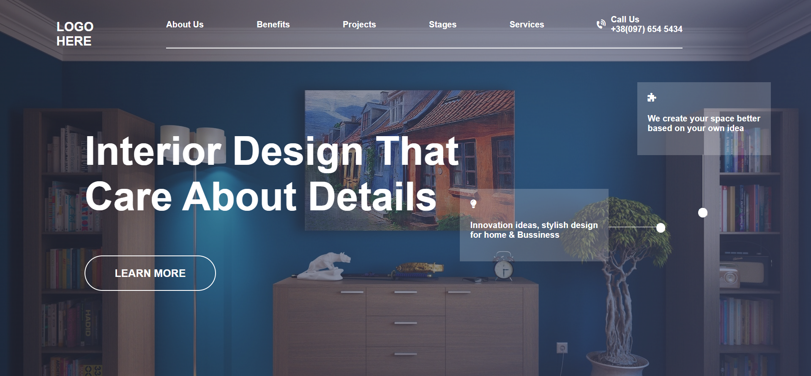

# HTML Project 10
**I Am Abhishek Singh**
> This is my Tenth project of HTML and CSS and it have one page content with and have more challenging cardsa and those line going from card which are floating on top of the page.

 #

## Project Web page

In this Project I learned about position absolute by which we can place the element left, right, top and bottom according to body frame.

#

### Duration Of Completing this project
> Honestly it took me more than **3 hours** .

[Visit This Project Live](https://abhi-project-1.netlify.app/)

#

To see my work visit my [Portfolio]("my-portfolio-website")

